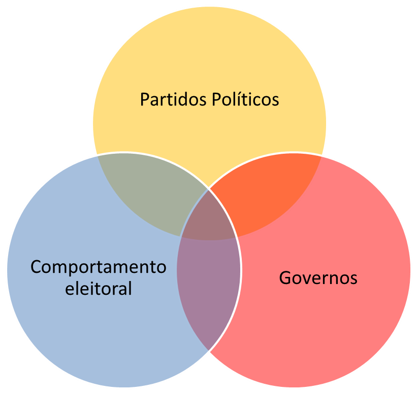

```{r setup, include=FALSE}
knitr::opts_chunk$set(echo = TRUE)
```

<div style="text-align: justify">


## 1. Apresentação
<br/><br/> \hfill\break
O Núcleo de Estudos em Representação e Democracia – NERD, tem por objetivo promover pesquisas sobre a evolução política e eleitoral nos níveis subnacionais, principalmente no nível municipal, assim como a relação da mesma com o desenvolvimento.

O grupo de pesquisa aborda a interseção entre três grandes dimensões da análise de sistemas políticos democráticos: governos, comportamento eleitoral e partidos políticos. A partir dos estudos sobre comportamento dos eleitores pretende-se integrar os achados empíricos às teorias sobre estratégias dos partidos políticos nas administrações públicas subnacionais, assim como interagir com análises sobre reeleição de prefeitos, análises que abordam ideologia partidária e gastos públicos no Brasil.

O NERD tem o objetivo de abranger estudos sobre política nacional visando estudos e análises comparadas. As atividades do NERD procuram atender a demanda de informações e análises no Brasil, tendo em conta que existe uma considerável escassez de informações empíricas sobre as características, funcionamento e desempenho das instituições políticas no nível municipal, assim como da interação da dimensão política com o desenvolvimento socioeconômico. 


 
 
 
 
O núcleo teve início da suas atividades com o projeto de pesquisa "Competição Eleitoral nos Municípios Brasileiros", em 2011, deu sequencia com o projeto CNPq “Poder Local, Partidos políticos e eleições municipais no Brasil pós 1988”, e atualmente é financiado pela FAPERJ com  projeto “Petro rendas e política local:
competição eleitoral e políticas públicas em municípios produtores de petróleo”.

 - Projeto FAPERJ E-26/111-677/2011."Competição Eleitoral nos Municípios Brasileiros”
 - Projeto CNPq: “Poder local, Partidos políticos e eleições municipais no Brasil pós 1988”.
 - Projeto FAPERJ APQ3 E-26/112.214/2013. “Financiamento de campanhas eleitorais no Brasil”.
 - Projeto FAPERJ - E-26/210-545/2019. “Petro rendas e política local: competição eleitoral e políticas públicas em municípios produtores de petróleo”.
 

## 2. Justificativa (melhorar esta justificativa)
<br/><br/> \hfill\break 
No Brasil existe uma considerável escassez de informações empíricas sobre o desempenho e funcionamento das instituições políticas municipais e das interações com o desenvolvimento socioeconômico. O Núcleo de Estudos em Representação e Democracia – NERD, procura contribuir para solucionar esse déficit. A maioria dos trabalhos que abordam o tema da política municipal, analisa as capitais estaduais ou municípios que introduziram novas formas de participação, como o orçamento participativo e os conselhos municipais. 

A Constituição de 1988 se orienta claramente por um princípio descentralizador e municipalista. No Capítulo IV (“Dos Municípios”), artigo 29 se estabelece que “o município reger-se-á por lei orgânica, votada em dois turnos, com interstício mínimo de dez dias, e aprovada por dois terços da Câmara Municipal (...)”. Já no artigo 30 do mesmo capítulo se estabelecem as competências dos municípios, em que se destacam as áreas de educação pré-escolar, ensino fundamental, saúde e saneamento, podendo ser solicitado para o cumprimento dessas funções, a cooperação técnica e financeira do Estado e da União. Incumbe também aos governos municipais instituir e arrecadar os tributos correspondentes a suas competências, assim como a alocação das receitas.

Junto com o incremento da autonomia municipal e de suas atribuições nas áreas mencionadas, a Constituição também valorizou os legislativos municipais, outorgando-lhes a possibilidade de introduzir emendas ao orçamento municipal, reforçando o poder político das Câmaras de Vereadores. Além dessa nova potestade, a relevância desses órgãos radica não somente na visibilidade dos temas sobre os que devem legislar muito próximos da vida cotidiana dos cidadãos, mas também, no vínculo direto de seus membros com as bases eleitorais. Porém, vários trabalhos têm destacado a hipertrofia dos Executivos nos municípios pequenos e médios, em relação aos Legislativos e Judiciários (Abrucio, 1994; Nunes, 1991).

Concomitantemente ao aumento das responsabilidades e atribuições dos municípios, houve também, a partir da aprovação da nova Constituição, um aumento das fontes tributárias e um repasse automático de receitas por parte dos Estados e do Governo Federal. Com efeito, as principais consequências da reforma constitucional foram um aumento substancial do poder tributário dos governos subnacionais nas suas respectivas jurisdições e um incremento das transferências da União para Estados e municípios (Abrucio e Couto, 1996; Giambiagi, 1991). 

Os dados censitários a partir de 1991 indicaram um crescimento populacional mais acelerado dos municípios de pequeno, médio e grande porte. Ressalta-se que em alguns municípios de grande porte tal perspectiva se manifestava com um ritmo de crescimento populacional superior ao das Regiões Metropolitanas na década de 1970. Nestes termos, Baeninger (1999: p.538), aponta para o fato de que “os municípios não-metropolitanos registraram um incremento relativo de 22%, no período 1970-1980, e de 6,7% no de 1991-1996”. Assim, pode-se perceber que o processo de interiorização que já vinha ocorrendo no Brasil em décadas anteriores, continuou sendo observado, agudizando-se a partir dos anos 2000.

Com base nestas considerações mais gerais propõe-se um núcleo de pesquisa focalizado nas questões relativas à política e ao desenvolvimento socioeconômico. As atividades do núcleo podem ser agrupadas em dois grandes eixos analíticos. O primeiro refere-se ao funcionamento das instituições políticas (eleições, administração pública, comportamento parlamentar e relação executivo-legislativo). O segundo eixo concerne ao desenvolvimento socioeconômico (atividades produtivas, estrutura social, mercado de trabalho e perfil social dos municípios). É objetivo do NERD, nos seus projetos de pesquisa e nas suas atividades em geral, analisar as possíveis relações entre ambos eixos temáticos. Inclui-se nesta proposta o intuito de contribuir com produção de informação e conhecimento científico relevante sobre o desenvolvimento político, econômico e social dos municípios brasileiros, assim como estudos que abordem o desempenho político institucional de outras regiões e municípios do país, possibilitando ainda a realização de análises comparadas, outra dos objetivos do NERD.


## 3. Objetivos
<br/><br/> \hfill\break 
Como foi definido, o NERD, tem por objetivo promover pesquisas sobre a evolução política e eleitoral no nível municipal, assim como a relação da mesma com o desenvolvimento. O NERD tem o objetivo de abranger estudos sobre política em todo o país, visando estudos e análises comparadas.

Os objetivos específicos do núcleo a destacar são:

- Difusão dos resultados das pesquisas para o âmbito acadêmico e extra-acadêmico (encontros, seminários, mini-cursos, etc.). 

- Promover a participação de alunos de graduação (iniciação científica) e pós-graduação nas atividades do núcleo.

- Organizar e compartilhar bases de dados destinados a subsidiar pesquisas acadêmicas e a demandas de instituições públicas e privadas, formadores de opinião e público em geral.

- Participar em editais de financiamento de pesquisas e atividades de extensão.


## 4. Membros
<br/> <br/> 

[Vitor de Moraes Peixoto](http://lattes.cnpq.br/4676437210734787)  <br/> \hfill\break
**Coordenador** <br/> \hfill\break
Professor Associado <br/> \hfill\break
Universidade Estadual do Norte Fluminense Darcy Ribeiro <br/> \hfill\break
Centro de Ciências do Homem <br/> \hfill\break
Laboratório de Estudos da Sociedade Civil e do Estado <br/> \hfill\break
E-mail: moraespeixoto@gmail.com <br/> \hfill\break

[Ralph André Crespo](http://lattes.cnpq.br/7250750885312461) <br/> \hfill\break
Doutorando do Programa de Pós-Graduação em Sociologia Politica <br/> \hfill\break
Universidade Estadual do Norte Fluminense Darcy Ribeiro <br/> \hfill\break
Laboratório de Estudos do Estado e da Sociedade Civil <br/> \hfill\break
E-mail: pr.ralph@yahoo.com.br <br/> \hfill\break

[Jheniffer Vieira de Almeida](http://lattes.cnpq.br/1477388811747167) <br/> \hfill\break
Doutoranda do Programa de Pós-Graduação em Sociologia Politica <br/> \hfill\break
Universidade Estadual do Norte Fluminense Darcy Ribeiro <br/> \hfill\break
Laboratório de Estudos do Estado e da Sociedade Civil <br/> \hfill\break
E-mail: jheniffer.vi@gmail.com <br/> \hfill\break

[Raphael de Mello Veloso](http://lattes.cnpq.br/9433034841064768) <br/> \hfill\break
Doutorando do Programa de Pós-Graduação em Sociologia Politica <br/> \hfill\break
Universidade Estadual do Norte Fluminense Darcy Ribeiro <br/> \hfill\break
Laboratório de Estudos do Estado e da Sociedade Civil <br/> \hfill\break
E-mail: raphamv@gmail.com  <br/> \hfill\break

[Gisele Braga Bastos](http://lattes.cnpq.br/1675744772217864) <br/> \hfill\break
Doutoranda do Programa de Pós-Graduação em Sociologia Politica <br/> \hfill\break
Universidade Estadual do Norte Fluminense Darcy Ribeiro <br/> \hfill\break
Laboratório de Estudos do Estado e da Sociedade Civil <br/>\hfill\break
E-mail: gibragabastos@gmail.com <br/> \hfill\break

[Jessica Matheus de Souza](http://lattes.cnpq.br/6717255818088404) <br/> \hfill\break
Doutoranda do Programa de Pós-Graduação em Sociologia Politica <br/> \hfill\break
Universidade Estadual do Norte Fluminense Darcy Ribeiro <br/> \hfill\break
Laboratório de Estudos do Estado e da Sociedade Civil <br/> \hfill\break
E-mail: jessicamatheus@outlook.com  <br/> \hfill\break

[Wallace da Silva Mello](http://lattes.cnpq.br/8178088513307546) <br/> \hfill\break
Doutorando do Programa de Pós-Graduação em Sociologia Politica <br/> \hfill\break
Universidade Estadual do Norte Fluminense Darcy Ribeiro <br/> \hfill\break
Laboratório de Estudos do Estado e da Sociedade Civil <br/> \hfill\break
E-mail: wallace_sm89@hotmail.com <br/> \hfill\break

[Thiago Pimentel Soares](http://lattes.cnpq.br/5038496684551538) <br/> \hfill\break
Mestrando do Programa de Pós-Graduação em Sociologia Politica <br/> \hfill\break
Universidade Estadual do Norte Fluminense Darcy Ribeiro <br/> \hfill\break
Laboratório de Estudos do Estado e da Sociedade Civil <br/> \hfill\break
E-mail: tpsoares@hotmail.com <br/> \hfill\break

[Rafael Soares Salles](http://lattes.cnpq.br/6781198318316057) <br/> \hfill\break
Mestrando do Programa de Pós-Graduação em Sociologia Politica <br/> \hfill\break
Universidade Estadual do Norte Fluminense Darcy Ribeiro <br/> \hfill\break
Laboratório de Estudos do Estado e da Sociedade Civil <br/> \hfill\break 
E-mail: rafael.salles@outlook.com <br/> \hfill\break

[Larissa Martins Marques](http://lattes.cnpq.br/8424422005329610) <br/> \hfill\break
Graduanda do Curso de Administração Pública <br/> \hfill\break
Universidade Estadual do Norte Fluminense Darcy Ribeiro  <br/> \hfill\break
Laboratório de Estudos do Estado e da Sociedade Civil <br/> \hfill\break
E-mail: larissamarques@pq.uenf.br <br/> \hfill\break

[Matheus Virginio Harduim Machado](http://lattes.cnpq.br/6781198318316057) <br/> \hfill\break
Graduando do Curso de Ciências Sociais <br/> \hfill\break
niversidade Estadual do Norte Fluminense Darcy Ribeiro  <br/> \hfill\break
Laboratório de Estudos do Estado e da Sociedade Civil <br/> \hfill\break
E-mail: mattharduim@gmail.com <br/> \hfill\break

[Fernanda da Silva Souza](http://lattes.cnpq.br/7181203038300743) <br/> \hfill\break
Graduanda do Curso de Ciências Sociais <br/> \hfill\break
niversidade Estadual do Norte Fluminense Darcy Ribeiro <br/> \hfill\break
Laboratório de Estudos do Estado e da Sociedade Civil <br/> \hfill\break
E-mail: fer.souzaa1@outlook.com <br/> \hfill\break

[Lara Bernardo de Oliveira](http://lattes.cnpq.br/6943283489647623) <br/> \hfill\break
Graduanda do Curso de Ciências Sociais <br/> \hfill\break 
niversidade Estadual do Norte Fluminense Darcy Ribeiro <br/> \hfill\break
Laboratório de Estudos do Estado e da Sociedade Civil <br/> \hfill\break
E-mail: lalabernardo1904@gmail.com <br/> \hfill\break

[Paula Regis]() <br/> \hfill\break
Graduanda do Curso de Administração Pública <br/> \hfill\break
Universidade Estadual do Norte Fluminense Darcy Ribeiro <br/> \hfill\break
Laboratório de Estudos do Estado e da Sociedade Civil <br/> \hfill\break
E-mail: regispaularegis@gmail.com <br/>\hfill\break

<br/><br/> \hfill\break \hfill\break
Falta inserir os pós doutorandos.
<br/><br/> \hfill\break \hfill\break

## 5. Localização
<br/><br/> \hfill\break \hfill\break
Universidade Estadual do Norte Fluminense Darcy Ribeiro <br/> \hfill\break
Centro de Ciências do Homem – CCH – Sala 108 - B <br/> \hfill\break
Av. Alberto Lamego, 2000 - Parque Califórnia <br/> \hfill\break
Campos dos Goytacazes - RJ <br/> \hfill\break
CEP: 28013-602 <br/> \hfill\break
Tel: 22 27397040 <br/> \hfill\break


