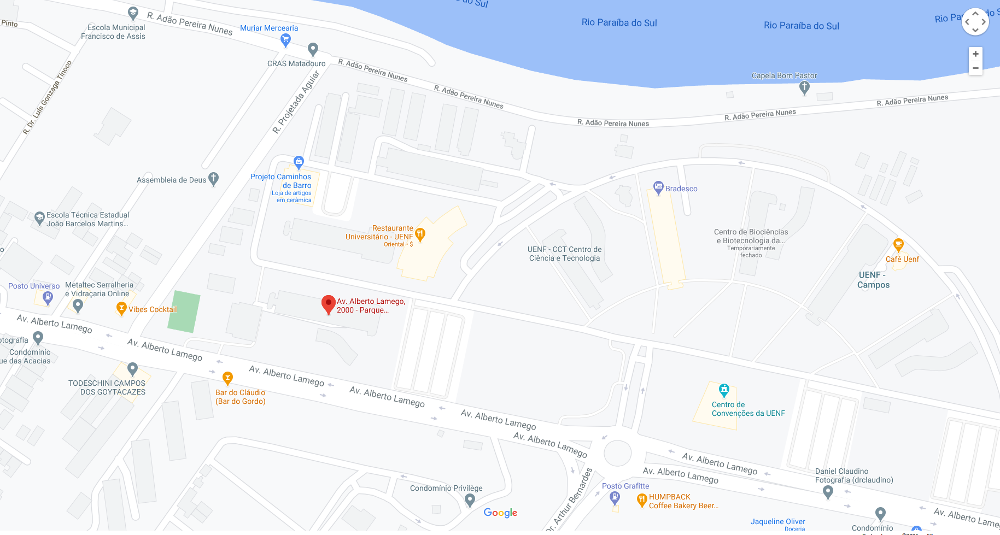

```{r setup, include=FALSE}
knitr::opts_chunk$set(echo = TRUE)
library(ggmap)
```

<div style="text-align: justify">

\pagebreak 


## 1. Apresentação


O Núcleo de Estudos em Representação e Democracia – NERD – se configura como um grupo de pesquisa que reúne pesquisadores de Ciência Política, Sociologia e Administração pública de instituições ligadas ao Programa de pós-graduação em Sociologia Política da UENF. Está integrado aos cursos de graduação do Centro de Ciências do Homem - CCH - e vinculado ao Laboratório de Estudos da Sociedade Civil e do Estado (LESCE).

O grupo de pesquisa aborda a interseção entre três grandes dimensões da análise de sistemas políticos democráticos: governos locais, comportamento eleitoral e partidos políticos. A partir dos estudos sobre comportamento dos eleitores pretende-se integrar os achados empíricos às teorias sobre estratégias dos partidos políticos nas administrações públicas subnacionais, assim como interagir com análises sobre reeleição de prefeitos, análises que abordam ideologia partidária e gastos públicos no Brasil.

O NERD busca abranger estudos sobre política nacional visando estudos e análises comparadas. As atividades do NERD procuram atender a demanda de informações e análises no Brasil, assim como da interação da dimensão política com o desenvolvimento socioeconômico. 


 
 
 
O núcleo teve início da suas atividades com o projeto de pesquisa "Competição Eleitoral nos Municípios Brasileiros", em 2011, deu sequencia com o projeto CNPq “Poder Local, Partidos políticos e eleições municipais no Brasil pós 1988”, e atualmente é financiado pela FAPERJ com  projeto “Petro rendas e política local:
competição eleitoral e políticas públicas em municípios produtores de petróleo”.

 

O NERD tem por filosofia a utilização de softwares livres e preza pela divulgação de resultados científicos com reprodutibilidade. 

## 2. Justificativa 

A formação do núcleo de pesquisa se justifica pela necessidade de reunir, coordenar e estimular pesquisadores que coadunam interesses temáticos com a unidade  teórico-metodológica sob o mesmo guarda-chuva institucional.

A maioria dos trabalhos que abordam o tema da política municipal analisam as capitais estaduais ou municípios que introduziram novas formas de participação, como o orçamento participativo e os conselhos municipais, em geral, por meio de metodologias qualitativas que privilegiam os estudos de casos. Na intenção de atenuar esse déficit, o Núcleo de Estudos em Representação e Democracia – NERD prioriza abordagens quantitativas que abarcam as 5.570 unidades federativas.


A Constituição de 1988 se orienta claramente por um princípio descentralizador e municipalista. No Capítulo IV (“Dos Municípios”), artigo 29 se estabelece que “o município reger-se-á por lei orgânica, votada em dois turnos, com interstício mínimo de dez dias, e aprovada por dois terços da Câmara Municipal (...)”. Já no artigo 30 do mesmo capítulo se estabelecem as competências dos municípios, em que se destacam as áreas de educação pré-escolar, ensino fundamental, saúde e saneamento, podendo ser solicitado para o cumprimento dessas funções, a cooperação técnica e financeira do Estado e da União. Incumbe também aos governos municipais instituir e arrecadar os tributos correspondentes a suas competências, assim como a alocação das receitas.

Junto com o incremento da autonomia municipal e de suas atribuições nas áreas mencionadas, a Constituição também valorizou os legislativos municipais, outorgando-lhes a possibilidade de introduzir emendas ao orçamento municipal, reforçando o poder político das Câmaras de Vereadores. Além dessa nova potestade, a relevância desses órgãos radica não somente na visibilidade dos temas sobre os que devem legislar muito próximos da vida cotidiana dos cidadãos, mas também, no vínculo direto de seus membros com as bases eleitorais. Porém, vários trabalhos têm destacado a hipertrofia dos Executivos nos municípios pequenos e médios, em relação aos Legislativos e Judiciários (Abrucio, 1994; Nunes, 1991).

Concomitantemente ao aumento das responsabilidades e atribuições dos municípios, houve também, a partir da aprovação da nova Constituição, um aumento das fontes tributárias e um repasse automático de receitas por parte dos Estados e do Governo Federal. Com efeito, as principais consequências da reforma constitucional foram um aumento substancial do poder tributário dos governos subnacionais nas suas respectivas jurisdições e um incremento das transferências da União para Estados e municípios (Abrucio e Couto, 1996; Giambiagi, 1991). 

Os dados censitários a partir de 1991 indicaram um crescimento populacional mais acelerado dos municípios de pequeno, médio e grande porte. Ressalta-se que em alguns municípios de grande porte tal perspectiva se manifestava com um ritmo de crescimento populacional superior ao das Regiões Metropolitanas na década de 1970. Nestes termos, Baeninger (1999: p.538), aponta para o fato de que “os municípios não-metropolitanos registraram um incremento relativo de 22%, no período 1970-1980, e de 6,7% no de 1991-1996”. Assim, pode-se perceber que o processo de interiorização que já vinha ocorrendo no Brasil em décadas anteriores, continuou sendo observado, agudizando-se a partir dos anos 2000.

Outro ponto relevante é o fato de haver uma defasagem no que se refere as análises que se pretendem a compreender os possíveis efeitos causais entre a discricionariedade do ocupante da cadeira do executivo local e a provisão de políticas públicas.

Uma das maiores consequências da descentralização federativa foi o destaque dado aos governos locais no que tange à provisão de políticas sociais, como as políticas de saúde e as políticas de educação. A despeito dos mínimos constitucionais de aplicação financeira nessas áreas, estudos apontam que ainda há espaço para que os prefeitos ponham as suas marcas políticas na gestão dessas ações estatais. Estudar este aspecto é um dos comprometimentos do laboratório.

Ainda nesse contexto, as pesquisas empíricas realizadas pelo NERD pretendem dar conta das relações entre as práticas enquanto gestor municipal e a premiação ou punição eleitoral. Um dos encargos científicos deste grupo é analisar os possíveis impactos da gestão da máquina municipal sobre o fracasso ou sucesso eleitoral dos prefeitos, tais como o aumento/diminuição do gasto com educação, aumento/diminuição de leitos hospitalares.

Com base nestas considerações propõe-se um núcleo de pesquisa que privilegia as questões relativas à política pública, eleições e ao desenvolvimento socioeconômico. As atividades do núcleo podem ser agrupadas em três grandes eixos analíticos: (1) o funcionamento das instituições políticas (eleições, administração pública, comportamento parlamentar e relação executivo-legislativo);  (2) desenvolvimento socioeconômico (atividades produtivas, estrutura social, mercado de trabalho e perfil social dos municípios); (3) comportamento eleitoral e opinião pública.


## 3. Objetivos

Os projetos de pesquisa e nas suas atividades em geral, analisar as possíveis relações entre trÊs eixos temáticos: o comportamento eleitoral do brasileiro, estratégias eleitorais partidárias e a provisão de políticas públicas locais.

No que concerne ao comportamento eleitoral, o NERD tem por objetivo construir análises no nível individual sobre um conjunto de variáveis atitudinais e comportamentais que englobam apoio à democracia, tolerância política, intenção de voto, ideologia, conservadorismo, partidarismo, etc.

Na dimensão das estratégias eleitorais dos partidos políticos, o grupo de pesquisa desenvolve uma série de estudos acerca dos desempenhos eleitorais, lançamentos de candidaturas, competição intra e inter partidárias, organização interna dos partidos, políticas eleitorais de gênero, assim como instituições reguladoras das eleições, como TRE's e TSE. 


Na dimensão sobre governos locais, inclui-se o intuito de contribuir com produção de informação e conhecimento científico relevante sobre o desenvolvimento político, econômico e social dos municípios brasileiros, assim como estudos que abordem o desempenho político institucional de outras regiões e municípios do país, possibilitando ainda a realização de análises comparadas. Portanto, o NERD tem também por objetivo promover pesquisas sobre a evolução política e eleitoral no nível municipal.


Os objetivos específicos do núcleo a destacar são:

- Difusão dos resultados das pesquisas para o âmbito acadêmico e extra-acadêmico (encontros, seminários, mini-cursos, etc.). 

- Promover a participação de alunos de graduação (iniciação científica) e pós-graduação nas atividades do núcleo.

- Organizar e compartilhar bases de dados destinados a subsidiar pesquisas acadêmicas e a demandas de instituições públicas e privadas, formadores de opinião e público em geral.

- Participar em editais de financiamento de pesquisas e atividades de extensão.

- Receber pesquisadores de outras instituições.

- Promover pesquisas interinstitucionais com pesquisadores nacionais e internacionais.


## 4. Membros
<br/> 

[Vitor de Moraes Peixoto](http://lattes.cnpq.br/4676437210734787)  <br/> \hfill\break
**Coordenador** <br/> \hfill\break
Professor Associado <br/> \hfill\break
Universidade Estadual do Norte Fluminense Darcy Ribeiro <br/> \hfill\break
Centro de Ciências do Homem <br/> \hfill\break
Laboratório de Estudos da Sociedade Civil e do Estado <br/> \hfill\break
E-mail: vpeixoto@pq.uenf.br <br/> \hfill\break

[Renato Barreto de Souza](http://lattes.cnpq.br/4208615645719699) <br/> \hfill\break
Professor do Instituto Federal Fluminense <br/> \hfill\break
Pós doutorando do Programa de Pós-Graduação em Sociologia Politica <br/> \hfill\break
Universidade Estadual do Norte Fluminense Darcy Ribeiro <br/> \hfill\break
Laboratório de Estudos do Estado e da Sociedade Civil <br/> \hfill\break
E-mail: renatobs@gmail.com  <br/> \hfill\break

[Cleinton Roberto Perpeto de Souza](http://lattes.cnpq.br/9603711186053943)\hfill\break
Pós doutorando do Programa de Pós-Graduação em Sociologia Politica <br/> \hfill\break
Universidade Estadual do Norte Fluminense Darcy Ribeiro <br/> \hfill\break
Laboratório de Estudos do Estado e da Sociedade Civil <br/> \hfill\break
E-mail: cleintongael@gmail.com <br/> \hfill\break

[Patricia de Oliveira Burlamaqui](http://lattes.cnpq.br/6620703529177610)\hfill\break
Pós doutoranda do Programa de Pós-Graduação em Sociologia Politica <br/> \hfill\break
Universidade Estadual do Norte Fluminense Darcy Ribeiro <br/> \hfill\break
Laboratório de Estudos do Estado e da Sociedade Civil <br/> \hfill\break
E-mail: pburlamaqui@gmail.com <br/> \hfill\break

[Ralph André Crespo](http://lattes.cnpq.br/7250750885312461) <br/> \hfill\break
Doutorando do Programa de Pós-Graduação em Sociologia Politica <br/> \hfill\break
Universidade Estadual do Norte Fluminense Darcy Ribeiro <br/> \hfill\break
Laboratório de Estudos do Estado e da Sociedade Civil <br/> \hfill\break
E-mail: ralph.crespo@pq.uenf.br <br/> \hfill\break

[Jheniffer Vieira de Almeida](http://lattes.cnpq.br/1477388811747167) <br/> \hfill\break
Doutoranda do Programa de Pós-Graduação em Sociologia Politica <br/> \hfill\break
Universidade Estadual do Norte Fluminense Darcy Ribeiro <br/> \hfill\break
Laboratório de Estudos do Estado e da Sociedade Civil <br/> \hfill\break
E-mail: jhenifferalmeida@pq.uenf <br/> \hfill\break

[Raphael de Mello Veloso](http://lattes.cnpq.br/9433034841064768) <br/> \hfill\break
Doutorando do Programa de Pós-Graduação em Sociologia Politica <br/> \hfill\break
Universidade Estadual do Norte Fluminense Darcy Ribeiro <br/> \hfill\break
Laboratório de Estudos do Estado e da Sociedade Civil <br/> \hfill\break
E-mail: raphamv@gmail.com  <br/> \hfill\break

[Gisele Braga Bastos](http://lattes.cnpq.br/1675744772217864) <br/> \hfill\break
Doutoranda do Programa de Pós-Graduação em Sociologia Politica <br/> \hfill\break
Universidade Estadual do Norte Fluminense Darcy Ribeiro <br/> \hfill\break
Laboratório de Estudos do Estado e da Sociedade Civil <br/>\hfill\break
E-mail: gibragabastos@pq.uenf.br <br/> \hfill\break

[Jessica Matheus de Souza](http://lattes.cnpq.br/6717255818088404) <br/> \hfill\break
Doutoranda do Programa de Pós-Graduação em Sociologia Politica <br/> \hfill\break
Universidade Estadual do Norte Fluminense Darcy Ribeiro <br/> \hfill\break
Laboratório de Estudos do Estado e da Sociedade Civil <br/> \hfill\break
E-mail: jessicamatheus@pq.uenf.br <br/> \hfill\break

[Wallace da Silva Mello](http://lattes.cnpq.br/8178088513307546) <br/> \hfill\break
Doutorando do Programa de Pós-Graduação em Sociologia Politica <br/> \hfill\break
Universidade Estadual do Norte Fluminense Darcy Ribeiro <br/> \hfill\break
Laboratório de Estudos do Estado e da Sociedade Civil <br/> \hfill\break
E-mail: wallacesilvamello@pq.uenf.br <br/> \hfill\break

[Thiago Pimentel Soares](http://lattes.cnpq.br/5038496684551538) <br/> \hfill\break
Mestrando do Programa de Pós-Graduação em Sociologia Politica <br/> \hfill\break
Universidade Estadual do Norte Fluminense Darcy Ribeiro <br/> \hfill\break
Laboratório de Estudos do Estado e da Sociedade Civil <br/> \hfill\break
E-mail: tpsoares@hotmail.com <br/> \hfill\break

[Rafael Soares Salles](http://lattes.cnpq.br/6781198318316057) <br/> \hfill\break
Mestrando do Programa de Pós-Graduação em Sociologia Politica <br/> \hfill\break
Universidade Estadual do Norte Fluminense Darcy Ribeiro <br/> \hfill\break
Laboratório de Estudos do Estado e da Sociedade Civil <br/> \hfill\break 
E-mail: rafael.salles@pq.uenf.br <br/> \hfill\break

[João Gabriel Ribeiro Pessanha Leal](http://lattes.cnpq.br/9277299850069272) <br/> \hfill\break
Mestrando do Programa de Pós-Graduação em Ciência Política <br/> \hfill\break
Universidade Federal do Estado do Rio de Janeiro  <br/> \hfill\break
E-mail: joaoleal@pq.uenf.br  <br/> \hfill\break

[Larissa Martins Marques](http://lattes.cnpq.br/8424422005329610) <br/> \hfill\break
Graduanda do Curso de Administração Pública <br/> \hfill\break
Universidade Estadual do Norte Fluminense Darcy Ribeiro  <br/> \hfill\break
Laboratório de Estudos do Estado e da Sociedade Civil <br/> \hfill\break
E-mail: larissamarques@pq.uenf.br <br/> \hfill\break

[Matheus Virginio Harduim Machado](http://lattes.cnpq.br/6781198318316057) <br/> \hfill\break
Graduando do Curso de Ciências Sociais <br/> \hfill\break
niversidade Estadual do Norte Fluminense Darcy Ribeiro  <br/> \hfill\break
Laboratório de Estudos do Estado e da Sociedade Civil <br/> \hfill\break
E-mail: m.harduim@pq.uenf.br <br/> \hfill\break

[Fernanda da Silva Souza](http://lattes.cnpq.br/7181203038300743) <br/> \hfill\break
Graduanda do Curso de Ciências Sociais <br/> \hfill\break
niversidade Estadual do Norte Fluminense Darcy Ribeiro <br/> \hfill\break
Laboratório de Estudos do Estado e da Sociedade Civil <br/> \hfill\break
E-mail: fer.souzaa1@outlook.com <br/> \hfill\break

[Lara Bernardo de Oliveira](http://lattes.cnpq.br/6943283489647623) <br/> \hfill\break
Graduanda do Curso de Ciências Sociais <br/> \hfill\break 
niversidade Estadual do Norte Fluminense Darcy Ribeiro <br/> \hfill\break
Laboratório de Estudos do Estado e da Sociedade Civil <br/> \hfill\break
E-mail: lalabernardo1904@gmail.com <br/> \hfill\break

[Paula Regis Cordeiro de Araujo](http://lattes.cnpq.br/5081047341028478) <br/> \hfill\break
Graduanda do Curso de Administração Pública <br/> \hfill\break
Universidade Estadual do Norte Fluminense Darcy Ribeiro <br/> \hfill\break
Laboratório de Estudos do Estado e da Sociedade Civil <br/> \hfill\break
E-mail: regispaularegis@gmail.com <br/>\hfill\break


## 5. Projetos

### 5.1 - Em execução:

**Economia social da (In)tolerância política: como avaliações da economia, mobilidade social, escolaridade, gênero e religião impactam as atitudes democráticas no Brasil contemporâneo**

Este projeto visa produzir análises acerca das avaliações e percepções econômicas e seus impactos sobre um conjunto de atitudes e comportamentos individuais conhecidos por tolerância política ao longo dos últimos quatro ciclos eleitorais. Além disso, busca compreender como as variáveis sociológicas clássicas tais como religião, escolaridade, renda e sexo se relacionam aos aspectos tolerância e apoio à democracia. Dessa forma, procura aferir como essas variáveis interferem na opinião pública sobre a democracia, investigando e diferenciando o comportamento de grupos específicos em relação as organizações democráticas.

Fomento: UENF-Faperj

**Petro rendas e política local: competição eleitoral e políticas públicas em municípios produtores de petróleo**

Este projeto de pesquisa tem como objetivo a investigação de padrões partidários de gastos públicos em municípios petro-rentistas em dois contextos econômicos: de abundancias e crises severas de recursos. Propõem-se construir indicadores e testar modelos econométricos multivariados no intuito de explorar as características políticas dos executivos municipais que estão associadas à variação de padrões de comportamentos orçamentários na administração de recursos indenizatórios. Buscar-se-á comparar unidades da federação com características sociodemográficas similares no intuito de testar hipóteses os efeitos dos recursos dos royalties e participações especiais nos padrões de gastos sociais e com maquina pública dos partidos políticos.

Fomento: FAPERJ - APQ1
         CNPq - UENF


### 5.2 - Projetos finalizados:

 - Projeto FAPERJ E-26/111-677/2011."Competição Eleitoral nos Municípios Brasileiros”.
 
 - Projeto CNPq: “Poder local, Partidos políticos e eleições municipais no Brasil pós 1988”.
 
 - Projeto FAPERJ APQ3 E-26/112.214/2013. “Financiamento de campanhas eleitorais no Brasil”.
 

## 6. Localização


Universidade Estadual do Norte Fluminense Darcy Ribeiro <br/> \hfill\break
Centro de Ciências do Homem – CCH – Sala 108 - B <br/> \hfill\break
Av. Alberto Lamego, 2000 - Parque Califórnia <br/> \hfill\break
Campos dos Goytacazes - RJ <br/> \hfill\break
CEP: 28013-602 <br/> \hfill\break
Tel: 22 27397040 <br/> \hfill\break


[](https://www.google.com.br/maps/place/Av.+Alberto+Lamego,+2000+-+Parque+California,+Campos+dos+Goytacazes+-+RJ,+28013-602/@-21.7618032,-41.2934395,18z/data=!4m5!3m4!1s0xbdd59a0a81985b:0xf4793c8dba9348ac!8m2!3d-21.7623551!4d-41.2946988)


</div>

